# Hey there! 👋 I'm Prabhat Raj Rai

<div align="center">
  
</div>

<div align="center">
  
</div>


---

## 🚀 About Me

```typescript
const prabhat = {
    location: "India 🇮🇳",
    currentFocus: "Building systems that solve real business challenges",
    impact: "Bridging the gap between user needs and technical possibilities",
    specialization": "Turning operational headaches into automated workflows",
    approach: "Listen deeply, architect thoughtfully, deliver measurably",
    superpower: "Converting business requirements into scalable, maintainable systems",
    availableFor: "Innovative projects & technical collaborations",
    motto: "Build fast, break things, learn faster "
};
```

- Currently working on **Full Stack Web Applications**
- Learning **React Native, AI/ML, and Advanced DSA**
- Looking to collaborate on **Open Source Projects**
- Ask me about **React, Node.js, MongoDB, and Problem Solving**
---

## 🛠️ Tech Stack & Skills

<div align="center">

### 💻 Programming Languages


### 🎨 Frontend Development


### ⚙️ Backend Development


### 🛠️ Tools & Technologies


</div>

---

## 📊 GitHub Analytics & Performance

<div align="center">
  
  
</div>

<div align="center">
  
</div>

<div align="center">
  
</div>

---

## 🎯 What's Next?

```mermaid
graph TD
    A[Current Focus] --> B[React Native Mastery 📱]
    A --> C[AI/ML Exploration 🤖]
    A --> D[Competitive Programming 🏆]
    B --> E[Mobile App Development]
    C --> F[Machine Learning Projects]
    D --> G[Algorithm Optimization]
    E --> H[Full Stack Mobile Solutions]
    F --> I[AI-Powered Applications]
    G --> J[Problem Solving Expertise]
```

<div align="center">



</div>

---

## 🏆 GitHub Trophies

<div align="center">
  
</div>

---


<div align="center">
  


</div>

---

## 🌐 Connect with Me

<div align="center">

[](https://www.linkedin.com/in/prabhat-raj-rai-81984b196/)
[](mailto:prabhatrajrai4@gmail.com)
[](https://github.com/Rai-prabhatraj)
[](https://prabhatrajrai.xyz)

</div>

<div align="center">
  
</div>

---

<div align="center">
  
</div>

---

<div align="center">

  
  
  **Ready to build the future together? Let's turn ideas into digital reality! 🚀**
  
  
  **Thanks for visiting!**
</div>


⭐️ **From [Prabhat Raj Rai](https://github.com/Rai-prabhatraj)** with ❤️
