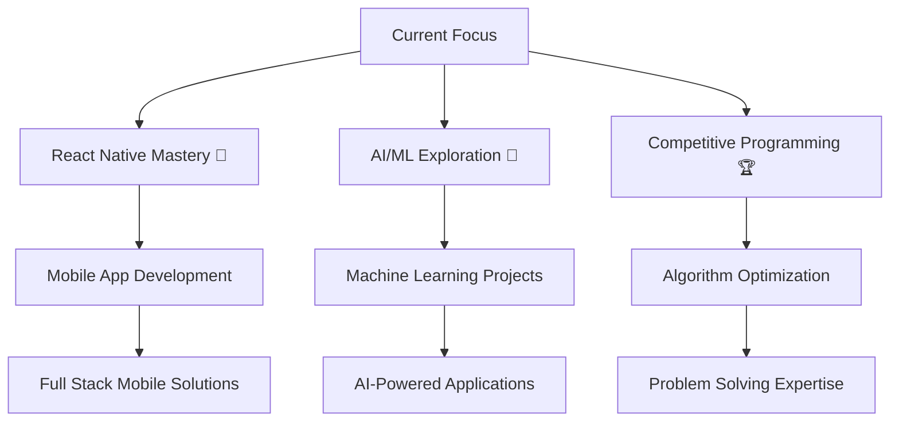

# Hey there! 👋 I'm Prabhat Raj Rai

<div align="center">
  
</div>

<div align="center">
  
</div>

---

## 🚀 About Me


```typescript
const prabhat = {
    location: "Bhilai, India 🇮🇳",
    education: "Rungta College of Engineering & Technology",
    currentFocus: "Full Stack Development & DSA",
    passion: "Building innovative solutions 💻",
    philosophy: "Knowledge is limitless 🧠",
    availableFor: "Collaborations & Learning opportunities",
    funFact: "I debug with console.log and I'm not ashamed! 😄"
};
```

- 🔭 Currently working on **Full Stack Web Applications**
- 🌱 Learning **React Native, AI/ML, and Advanced DSA**
- 👯 Looking to collaborate on **Open Source Projects**
- 💬 Ask me about **React, Node.js, MongoDB, and Problem Solving**
- ⚡ Fun fact: **I turn coffee into code! ☕➡️💻**

---

## 🛠️ Tech Stack & Skills

<div align="center">

### 💻 Programming Languages


### 🎨 Frontend Development


### ⚙️ Backend Development


### 🛠️ Tools & Technologies


</div>

---

## 📊 GitHub Analytics

<div align="center">
  
  
</div>

<div align="center">
  
</div>

<div align="center">
  
</div>

---

## 🎯 What's Next?

<div align="center">


```mermaid
graph TD
    A[Current Focus] --> B[React Native Mastery 📱]
    A --> C[AI/ML Exploration 🤖]
    A --> D[Competitive Programming 🏆]
    B --> E[Mobile App Development]
    C --> F[Machine Learning Projects]
    D --> G[Algorithm Optimization]
    E --> H[Full Stack Mobile Solutions]
    F --> I[AI-Powered Applications]
    G --> J[Problem Solving Expertise]
```

</div>

### 🔥 Goals for 2024-2025
- 🚀 Master React Native for cross-platform mobile development
- 🤖 Dive deep into AI/ML and build intelligent applications
- 🏅 Achieve expert level in competitive programming
- 🌐 Contribute to major open-source projects
- 📚 Learn cloud technologies (AWS/Azure)
- 🎯 Build a successful tech startup

---

## 🏆 GitHub Trophies

<div align="center">
  
</div>

---

## 📈 Contribution Graph

<div align="center">
  
</div>

---

## 🌐 Connect with Me

<div align="center">

[](https://www.linkedin.com/in/prabhat-raj-rai-81984b196/)
[](https://www.instagram.com/rai.prabhatraj/)
[](mailto:prabhatrajrai4@gmail.com)
[](https://github.com/Rai-prabhatraj)

</div>

<div align="center">
  
</div>

---

## 💭 Random Dev Quote

<div align="center">
  
</div>

---

<div align="center">
  <h3>🎵 "Code is like music. A good programmer is a good composer." 🎵</h3>
  
  **Thanks for visiting! Let's build something amazing together! 🚀**
  
  
</div>

---

⭐️ **From [Prabhat Raj Rai](https://github.com/Rai-prabhatraj)** with ❤️
